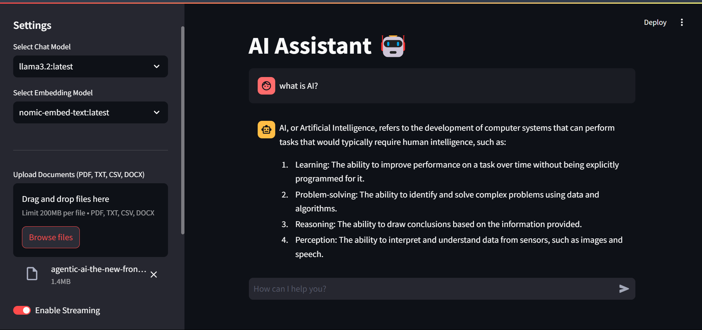

# OLLAMA CHAT

A ChatGPT-like AI Assistant powered by Ollama, built with FastAPI backend and Streamlit frontend.

## Features

- 🚀 Separate backend (FastAPI) and frontend (Streamlit) architecture
- 💬 ChatGPT-like chat interface with document context
- ⚡ Real-time streaming responses
- 🤖 Multiple Ollama model support (chat & embeddings)
- 📁 Document upload support (PDF, TXT, CSV, DOCX)
- 🔍 Context-aware answers using document content
- 📚 Multiple document processing
- ⚙️ Sidebar configuration panel with model selection
- 🔄 Session persistence
- 🌐 CORS-enabled API
- 🔌 Environment configuration support

## Prerequisites

- Python >= 3.10
- [Ollama](https://ollama.com/) installed and running
- At least one Ollama model pulled (e.g., `llama3.2:latest`)
- Recommended embedding model: `nomic-embed-text:latest`

## Installation

1. **Clone the repository**
```bash
git clone https://github.com/iammuhammadnoumankhan/OLLAMA_CHAT.git
cd OLLAMA_CHAT
```

### Sample Image


2. **Set up backend**
```bash
cd backend
python -m venv venv
source venv/bin/activate  # On Windows: venv\Scripts\activate
pip install -r requirements.txt
```

3. **Set up frontend**
```bash
cd ../frontend
python -m venv venv
source venv/bin/activate  # On Windows: venv\Scripts\activate
pip install -r requirements.txt
```

4. **Install document processing dependencies**
```bash
pip install pdfplumber docx2txt langchain-community
```

## Configuration

1. **Ollama Setup**
```bash
# Start Ollama service (in separate terminal)
ollama serve

# Pull models (examples)
ollama pull llama3.2:latest
ollama pull nomic-embed-text:latest
```

2. **Environment Variables**

Create `.env` files:

**backend/.env**
```env
OLLAMA_HOST=http://localhost:11434
```

**frontend/.env**
```env
BACKEND_URL=http://localhost:8000
OLLAMA_HOST=http://localhost:11434
```

## Usage

1. **Start Backend**
```bash
cd backend
uvicorn app.main:app --reload
```

2. **Start Frontend**
```bash
cd frontend
streamlit run app.py
```

3. **Using the Application**
- Upload documents via sidebar (200MB/file limit)
- Select chat and embedding models from dropdown
- Chat normally or ask questions about documents
- Toggle streaming responses

4. **Access Points**
- Frontend: [http://localhost:8501](http://localhost:8501)
- Backend API: [http://localhost:8000](http://localhost:8000)
- Ollama: [http://localhost:11434](http://localhost:11434)

## Tech Stack

- **Backend**:
  - Python FastAPI
  - Ollama Python Client
  - CORS Middleware
- **Frontend**:
  - Streamlit
  - Requests
  - LangChain (document processing)
- **AI**:
  - Ollama LLMs
  - Ollama Embeddings
  - Document loaders (PDF, CSV, DOCX, TXT)

## Troubleshooting

**Common Issues**:
1. **Document processing errors**:
   - Verify file size < 200MB
   - Check supported file formats
   - Ensure required dependencies are installed

2. **Embedding model issues**:
   - Pull embedding model: `ollama pull nomic-embed-text`
   - Check embedding model selection in sidebar

3. **Ollama connection issues**:
   - Verify `ollama serve` is running
   - Check `OLLAMA_HOST` in `.env` files
   - Test connection: `curl http://localhost:11434/api/tags`

4. **Model not found**:
   - Pull the model: `ollama pull <model-name>`
   - Refresh model list in frontend

## Contributing

Contributions are welcome! Please follow these steps:
1. Fork the repository
2. Create your feature branch (`git checkout -b feature/your-feature`)
3. Commit your changes (`git commit -am 'Add some feature'`)
4. Push to the branch (`git push origin feature/your-feature`)
5. Open a Pull Request

## License

This project is licensed under the MIT License. See the [LICENSE](LICENSE) file for details.
```

Key changes made:
1. Added document-related features to Features section
2. Added embedding model requirements
3. Added document processing dependencies installation step
4. Updated configuration instructions for embedding models
5. Added usage instructions for document uploads
6. Enhanced troubleshooting section with document-related issues
7. Updated tech stack with document processing components
8. Added note about file size limits and supported formats